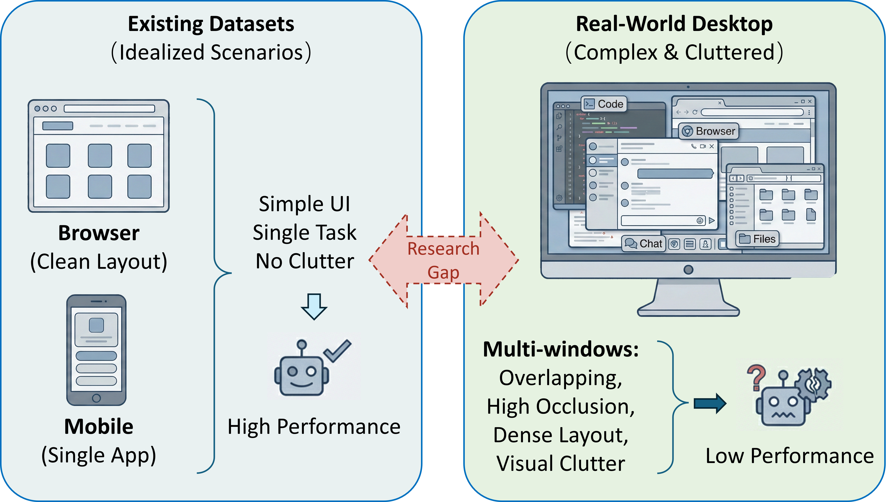
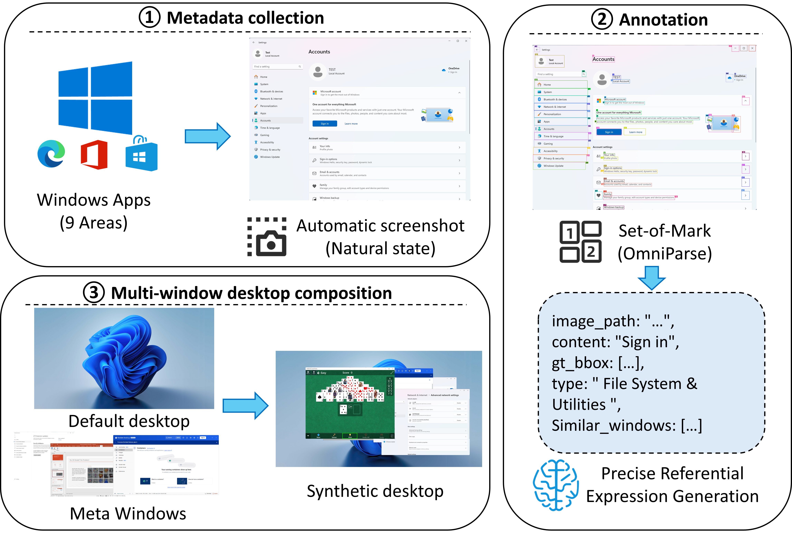
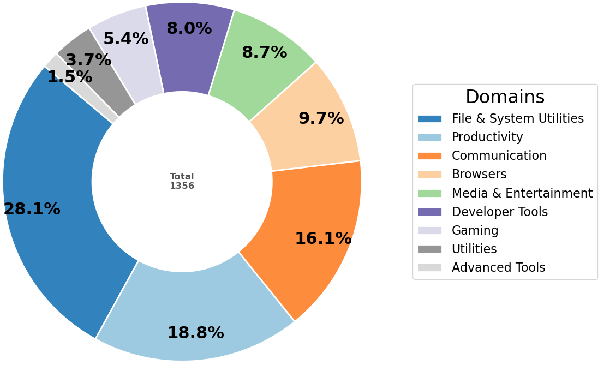
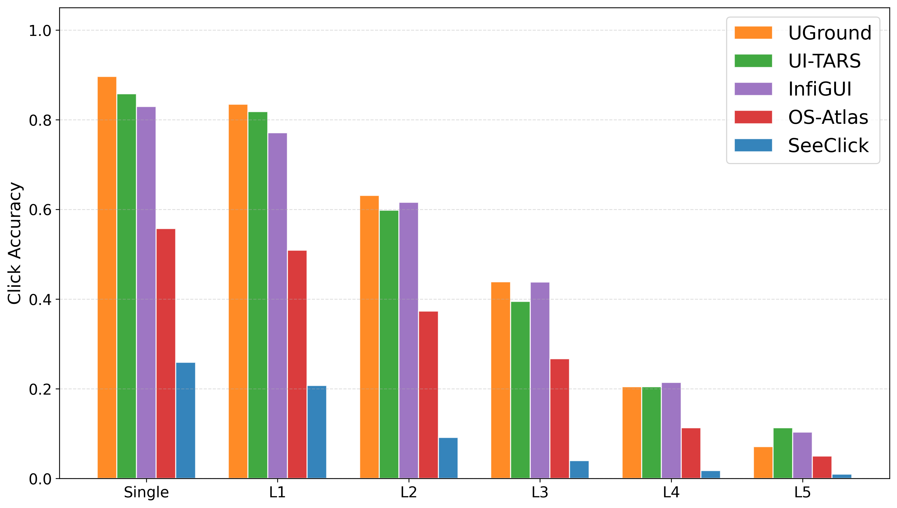
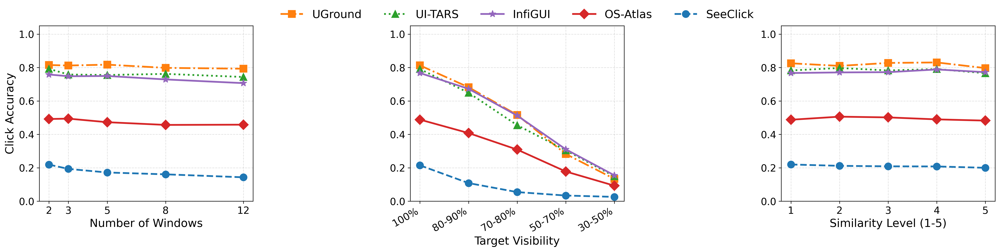
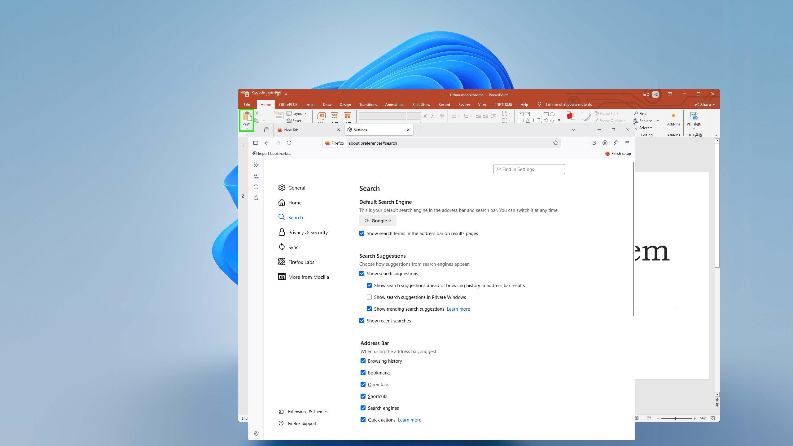

<div align="center">

# MultiWindows: GUI Grounding Benchmark in Multi-Window Scenes

<p>
Controlled data generation, difficulty-level simulation, and unified evaluation for desktop GUI grounding.
</p>

<p>
  <a href="#quick-start">Quick Start</a> •
  <a href="#dataset-and-benchmark-analysis">Results</a> •
  <a href="#dataset-and-benchmark-analysis">Analysis</a> •
  <a href="#reproducibility">Reproducibility</a>
</p>

</div>



## Overview

MultiWindows is a reproducible benchmark toolkit for evaluating GUI grounding models in realistic multi-window desktop environments.

It includes:
- sensitivity-controlled experiments for occlusion, semantic distraction, and clutter
- simulation difficulty levels from L1 to L5
- unified evaluation scripts for multiple local or API-based models
- automatic summary tables for cross-model comparison

## Dataset And Benchmark Analysis

### 1) Dataset Construction Pipeline



### 2) Dataset Distribution (Data Composition)


#### Dataset Distribution

| Category | Images | Samples |
|---|---:|---:|
| File&System_Utilitiess | 139 | 381 |
| Productivity | 143 | 255 |
| Communication | 77 | 218 |
| Browsers | 59 | 132 |
| Media&Entertainment | 56 | 118 |
| Developer_Tools | 47 | 108 |
| Gaming | 27 | 73 |
| Utilities | 24 | 50 |
| Advanced_Tools | 13 | 21 |
| Total | 585 | 1356 |



#### Domain Example Apps

| Domain | ExampleApps |
|---|---|
| Productivity | Word, Notepad, Excel |
| Browsers | GoogleChrome, Edge |
| Communication | Discord, Zoom, WeChat |
| Media&Entertainment | Spotify, Netflix |
| Utilities | 7-Zip, CCleaner |
| DeveloperTools | VSCode, DockerDesktop |
| File&System | Settings, FileExplorer |
| Gaming | Solitaire, XboxApp |
| AdvancedTools | PowerShell, ResourceMonitor |

### 3) Benchmark Result Analysis

Source: eval_outputs/benchmark_pivot.csv

#### 3.1 Difficulty Analysis



#### 3.2 Controlled Analysis



### 4) Dataset Case Studies

The visualizations below show representative samples from the dataset.

#### Case 1


#### Case 2



## Quick Start

### Environment

```bash
python -m venv .venv
source .venv/bin/activate
pip install -U pip
pip install torch transformers pillow tqdm pandas python-dotenv
```

### Required Inputs

- metadata: sentence_sim.json
- wallpaper: windows_background.jpg
- GUI image root: windows/

### Run End To End

```bash
bash run_benchmark_complete.sh eval_outputs
```

### Evaluate Only (skip generation)

```bash
bash run_benchmark_complete.sh eval_outputs --skip-gen
```

### Evaluate Selected Models

```bash
bash run_benchmark_complete.sh eval_outputs --skip-gen "infigui seed ui-tars-api"
```

## Reproducibility

### Generate Sensitivity Data

```bash
python sensitivity_analysis/experiment_generator.py \
  --metadata sentence_sim.json \
  --wallpaper windows_background.jpg \
  --image_root windows \
  --out_dir eval_outputs/sensitivity \
  --traverse \
  --experiments all
```

### Generate Simulation Data (L1-L5)

```bash
for d in L1 L2 L3 L4 L5; do
  python simulation/dataset_generator/run.py \
    --metadata sentence_sim.json \
    --wallpaper windows_background.jpg \
    --image_root windows \
    --out eval_outputs/simulation/$d \
    --traverse \
    --difficulty $d
done
```

### Summarize Benchmark

```bash
python eval/summarize_benchmark.py --output_dir eval_outputs
```

## Repository Layout

```text
.
├── assets/                              # Homepage figures
├── eval/                                # Evaluation and model adapters
├── sensitivity_analysis/                # Controlled sensitivity experiments
├── simulation/dataset_generator/        # Multi-window synthesis pipeline
├── run_benchmark_complete.sh            # End-to-end benchmark entry
└── eval_outputs/                        # Generated results and summaries
```

## Data And Outputs

```text
eval_outputs/
├── benchmark_summary.csv
├── benchmark_pivot.csv
├── sensitivity/
│   ├── baseline/single_window/
│   ├── occlusion/*
│   ├── semantic/*
│   └── clutter/*
└── simulation/
    ├── L1/
    ├── L2/
    ├── L3/
    ├── L4/
    └── L5/
```

## Privacy Checklist Before Open Source

- remove all secrets from .env
- replace machine-local absolute paths with env vars or config files
- avoid exposing private endpoint names or internal model identifiers
- keep generated artifacts and temporary files out of version control

## License

Please add your project license (for example MIT or Apache-2.0).
